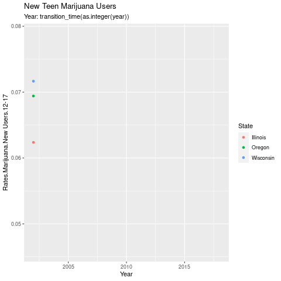

```{r setup, include=FALSE}
knitr::opts_chunk$set(echo = FALSE)

# Package names
packages <- c("knitr", "gifski", "gganimate", "ggplot2", "graphics",
              "grDevices", "dplyr", "magrittr", "readr", "ggthemes", 
              "tidyverse", "transformr")

# Install packages not yet installed
installed_packages <- packages %in% rownames(installed.packages())
if (any(installed_packages == FALSE)) {
  install.packages(packages[!installed_packages])
}

# Packages loading
invisible(lapply(packages, library, character.only = TRUE))

library(gifski)
library(datasets)
library(gganimate)
library(ggplot2)
library(graphics)
library(grDevices)
library(dplyr)
library(magrittr)
library(readr)
library(ggthemes)
```

## What is gganimate?
- Extension package used with ggplot2  
  
- Used to make animations using ggplots  
  - Can also save rendered plots as gifs  

```{r out.width = "200%",out.height = "60%",echo = FALSE, fig.align='center'}
#Image of slide 1
knitr::include_graphics("gganim_plot0099.png")
```

## Why use gganimate?  
- Offers simple and easy to implement functions for adding animations
- Can improve visualization of change in data
- Adds to presentation of data
```{r out.width = "100%",out.height = "100%",echo = FALSE, fig.align='center'}
#Image of slide 1
knitr::include_graphics("./images/data-science-communicate.png")
```


## gganimate Basics & Examples
- gganimate is primarily applied to ggplot objects by specifying transitions to use  
- There are 4 primary transition functions that will be covered:  
  - transition_time()  
  - transition_reveal()  
  - transition_filter()  
  - transition_states()  

---  
This is an R Markdown presentation. Markdown is a simple formatting syntax for authoring HTML, PDF, and MS Word documents. For more details on using R Markdown see <http://rmarkdown.rstudio.com>.

When you click the **Knit** button a document will be generated that includes both content as well as the output of any embedded R code chunks within the document.

## Slide with Bullets

- Bullet 1
- Bullet 2
- Bullet 3

## Slide with R Output

```{r cars, echo = TRUE}
summary(cars)
```

## Slide with Plot

```{r pressure}
plot(pressure)
```

## Transition States
- transition_states() is useful for non-time related transitions between data
- Also can make use of other fields or options to improve animation

```{r cho=FALSE,out.width="50%",out.height="50%"}


```
