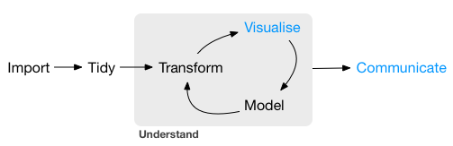
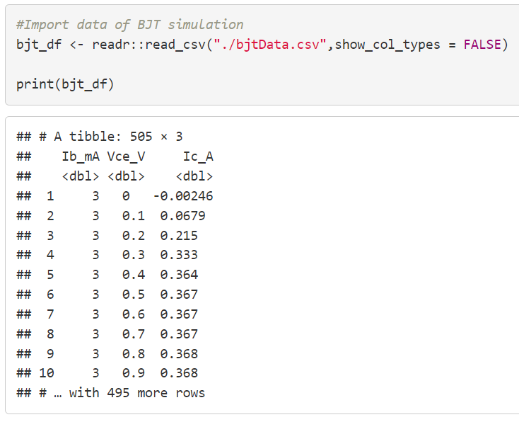
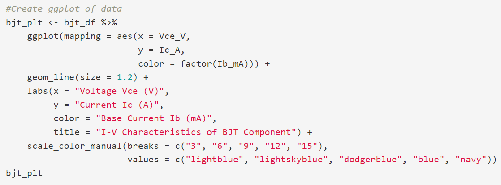
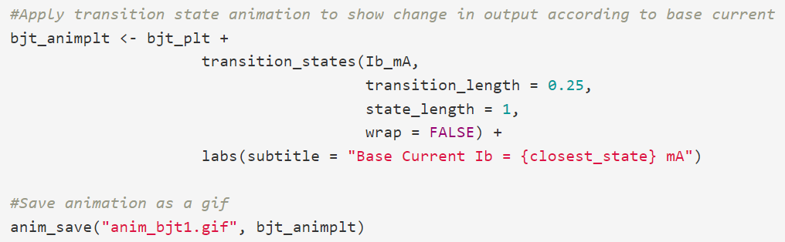
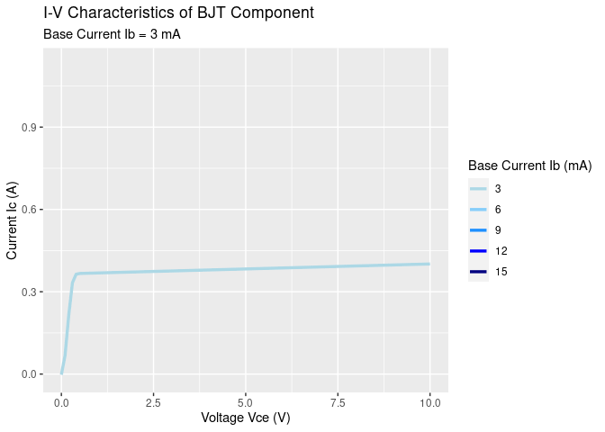
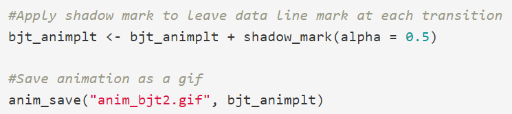

```{r setup, include=FALSE}
knitr::opts_chunk$set(echo = FALSE)
```

## What is gganimate?
- Extension package used with ggplot2  
  
- Used to make animations using ggplots  
  - Can also save rendered plots as gifs  

```{r out.width = "30%",out.height = "30%",echo = FALSE, fig.align='center'}
#Image of slide 1
knitr::include_graphics("./images/gganimate_logo_small.png")
```

## Why use gganimate?  
- Offers simple and easy to implement functions for adding animations
- Can improve visualization of change in data
- Adds to presentation of data
```{r out.width = "100%",out.height = "100%",echo = FALSE, fig.align='center'}
#Image of slide 1

```


## gganimate Basics & Examples
- gganimate is primarily applied to ggplot objects by specifying transitions to use  
- There are 4 primary transition functions that will be covered:  
  - transition_time()  
  - transition_reveal()  
  - transition_filter()  
  - transition_states()  

## Transition States
- transition_states() is useful for non-time related transitions between data
- Also can make use of other fields or options to improve animation
  
So, let's look at an example

## Transition States Example(1)
- Suppose we look at some simulated data of a BJT transistor circuit component:  
- The output behavior of the component generally looked at is voltage vs current  
- In this case, that would be Vce vs. Ic

```{r echo=FALSE,out.width="45%",out.height="45%",fig.align='center'}

```

## Transition States Example(2)
- The output function also depends on an input current Ib, however, and varies accordingly  
- As such, we get the following ggplot

```{r eval=TRUE,echo=FALSE,out.width="50%",out.height="100%",fig.align='default',fig.show='hold'}
knitr::include_graphics("./images/bjtggplot.PNG")

```

## Transition States Example(3)
- Showing the data in this format indicates the behavior, but we can improve it is communicated
- Applying state transitions to the Ib value, the behavior can then be made into the following animated plot
```{r eval=TRUE,echo=FALSE,out.width="50%",out.height="100%",fig.align='default',fig.show='hold'}


```

## Transition States Example(4)
- This better indicates how the function output behavior increases as Ib increases
- Furthermore, making use of shadow_mark(), we can then add onto the existing plot
  - shadow_mark() is similar to shadow_trail(), however it leaves a mark at the data state
```{r eval=TRUE,echo=FALSE,out.width="50%",out.height="100%",fig.align='default',fig.show='hold'}


```