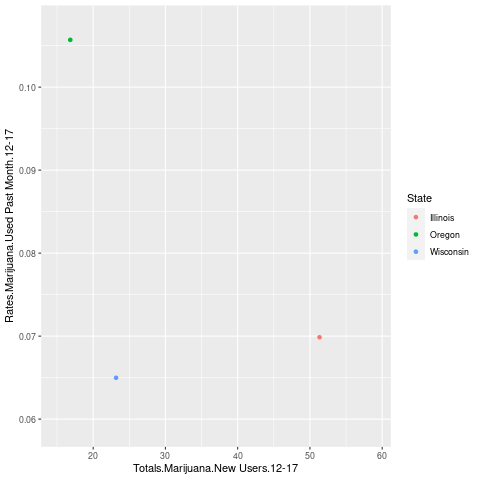

```{r setup, include=FALSE}
knitr::opts_chunk$set(echo = FALSE)
```

## What is gganimate?
- Extension package used with ggplot2  
  
- Used to make animations using ggplots  
  - Can also save rendered plots as gifs  

```{r out.width = "200%",out.height = "60%",echo = FALSE, fig.align='center'}
#Image of slide 1

```

## Why use gganimate?  
- Offers simple and easy to implement functions for adding animations
- Can help with presentation of information

---  
This is an R Markdown presentation. Markdown is a simple formatting syntax for authoring HTML, PDF, and MS Word documents. For more details on using R Markdown see <http://rmarkdown.rstudio.com>.

When you click the **Knit** button a document will be generated that includes both content as well as the output of any embedded R code chunks within the document.

## Slide with Bullets

- Bullet 1
- Bullet 2
- Bullet 3

## Slide with R Output

```{r cars, echo = TRUE}
summary(cars)
```

## Slide with Plot

```{r pressure}
plot(pressure)
```

