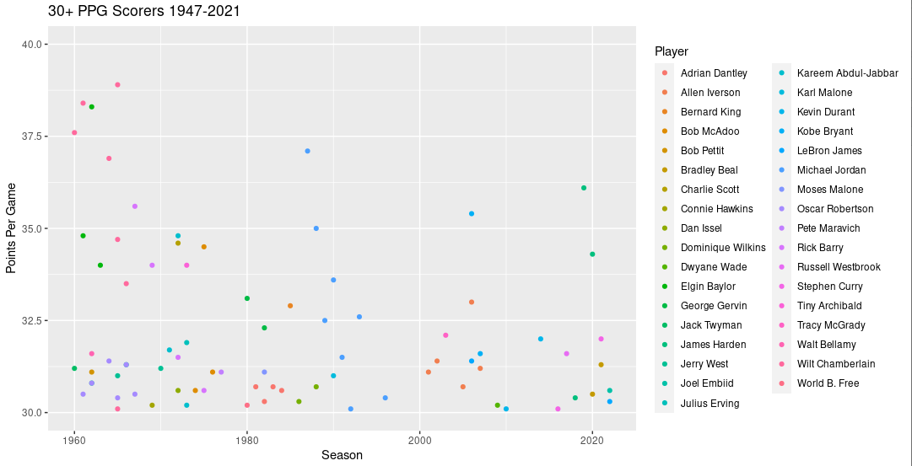
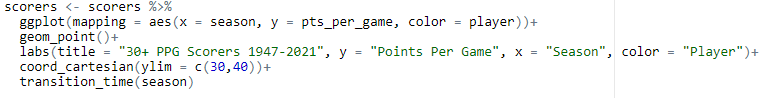
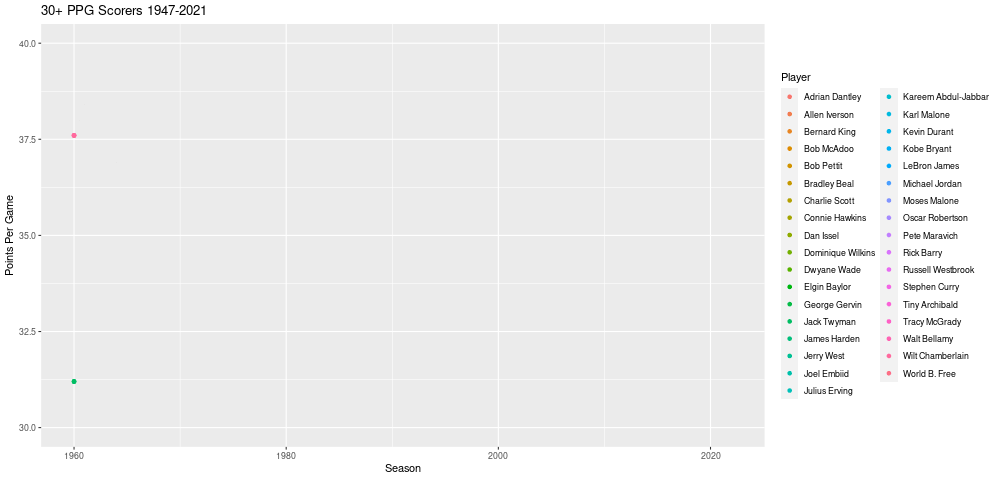
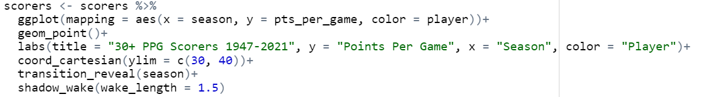
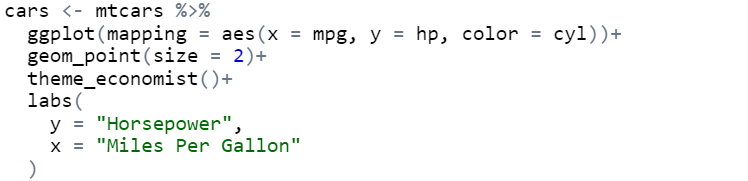
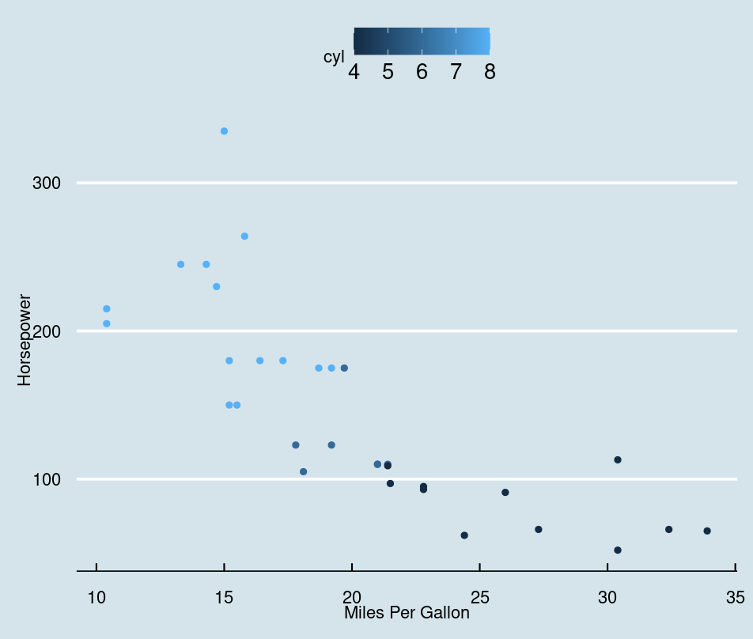
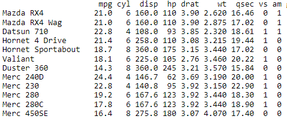
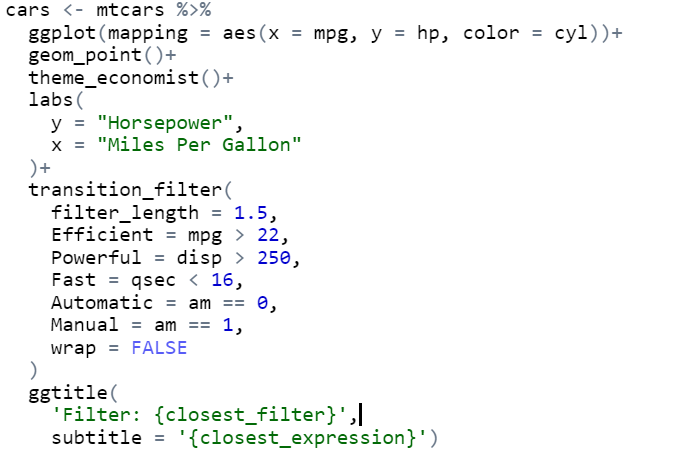
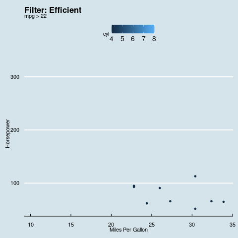

```{r setup, include=FALSE}
knitr::opts_chunk$set(echo = FALSE)
```

## What is gganimate?
- Extension package used with ggplot2  
  
- Used to make animations using ggplots  
  - Can also save rendered plots as gifs  

```{r out.width = "30%",out.height = "30%",echo = FALSE, fig.align='center'}
#Image of slide 1
knitr::include_graphics("./images/gganimate_logo_small.png")
```

## Why use gganimate?  
- Offers simple and easy to implement functions for adding animations
- Can improve visualization of change in data
- Adds to presentation of data
```{r out.width = "100%",out.height = "100%",echo = FALSE, fig.align='center'}
#Image of slide 1
knitr::include_graphics("./images/data-science-communicate.png")
```


## gganimate Basics & Examples
- gganimate is primarily applied to ggplot objects by specifying transitions to use  
- There are 4 primary transition functions that will be covered:  
  - transition_time()  
  - transition_reveal()  
  - transition_filter()  
  - transition_states()  
  
## transition_time() vs transition_reveal()
- The plot on the left shows all the seasons in NBA history in which a player averaged at least 30 points per game
- On the right the plot is animated using transition_time()

```{r, eval = TRUE, echo=FALSE, fig.show='hold', out.height="50%", out.width="50%"}



```

- The animation does not communicate much since the points disappear very quickly

## transition_time() vs transition_reveal()
- Instead we can see what the plot looks like when using transition_reveal() instead of transition_time()
- The animation on the left uses transition_time() and the animation on the right uses transition_reveal()

```{r, eval=TRUE,echo=FALSE, fig.show='hold', out.height="50%", out.width="50%"}


```
- transition_reveal() does a much better job of communicating the data than transition_time()

## shadow_wake()
- The animation can still be improved though. Any player that occurs on the list multiple times is only on the plot once
- Using the shadow_wake() function of gganimate we can add a wake to these players to show their scoring over their career

```{r,eval=TRUE,echo=FALSE, fig.show='hold', out.height="50%", out.width="50%"}


```

## shadow_wake()
- Here are the animations side by side

```{r, eval=TRUE,echo=FALSE, fig.show='hold', out.height="50%", out.width="50%"}


```
- Shadow_wake() communicates who the most productive players were over the course of their career instead of just a single season

## transition_filter
- The plot below shows all the cars in mtcars on a scatter plot with miles per gallon on the x-axis and horsepower on the y-axis
- This plot does not communicate much aside from the relationship between horsepower and miles per gallon
```{r, eval=TRUE,echo=FALSE, fig.show='hold', out.height="45%", out.width="45%"}


```
- Some simple animation could improve this plot

## transition_filter()
- Transition_filter() creates an animation that cycles through different filters of the data
- We can use other variables from mtcars other than hp and mpg to set filters 

```{r,eval=TRUE,echo=FALSE, fig.show='hold', out.height="50%", out.width="50%"}


```

## tranistion_filter()
- Once the transition_filter() function is applied our static plot is transformed into a more informative animation
```{r, eval=TRUE,echo=FALSE, fig.show='hold', out.height="50%", out.width="50%", fig.align='center'}

```
- The animation communicates trends within certain filters that would not be shown in the static plot

## Transition States
- transition_states() is useful for non-time related transitions between data
- Also can make use of other fields or options to improve animation
  
So, let's look at an example

## Transition States Example(1)
- Suppose we look at some simulated data of a BJT transistor circuit component:  
- The output behavior of the component generally looked at is voltage vs current  
- In this case, that would be Vce vs. Ic

```{r echo=FALSE,out.width="45%",out.height="45%",fig.align='center'}
knitr::include_graphics("./images/bjtdata_codechunk.PNG")
```

## Transition States Example(2)
- The output function also depends on an input current Ib, however, and varies accordingly  
- As such, we get the following ggplot

```{r eval=TRUE,echo=FALSE,out.width="50%",out.height="100%",fig.align='default',fig.show='hold'}
knitr::include_graphics("./images/bjtggplot.PNG")
knitr::include_graphics("./images/ggplot_codechunk.PNG")
```

## Transition States Example(3)
- Showing the data in this format indicates the behavior, but we can improve it is communicated
- Applying state transitions to the Ib value, the behavior can then be made into the following animated plot
```{r eval=TRUE,echo=FALSE,out.width="50%",out.height="100%",fig.align='default',fig.show='hold'}
knitr::include_graphics("./images/anim_bjt1.gif")
knitr::include_graphics("./images/transitionstate_codechunk1.PNG")
```

## Transition States Example(4)
- This better indicates how the function output behavior increases as Ib increases
- Furthermore, making use of shadow_mark(), we can then add onto the existing plot
  - shadow_mark() is similar to shadow_trail(), however it leaves a mark at the data state
```{r eval=TRUE,echo=FALSE,out.width="50%",out.height="100%",fig.align='default',fig.show='hold'}
knitr::include_graphics("./images/anim_bjt2.gif")
knitr::include_graphics("./images/transitionstate_codechunk2.PNG")
```