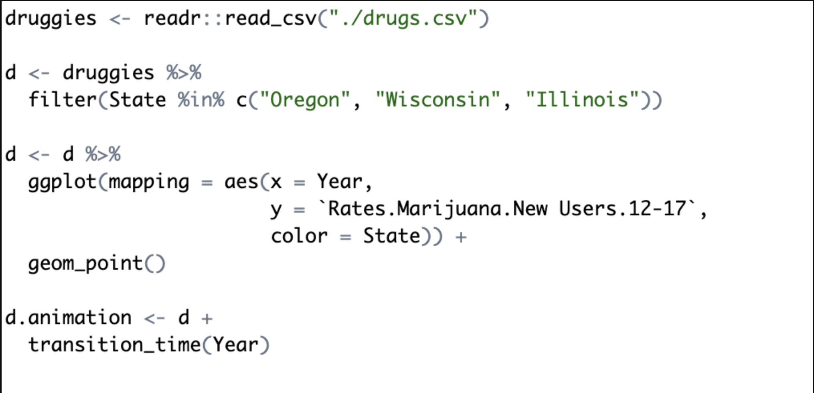
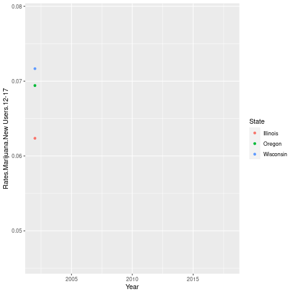
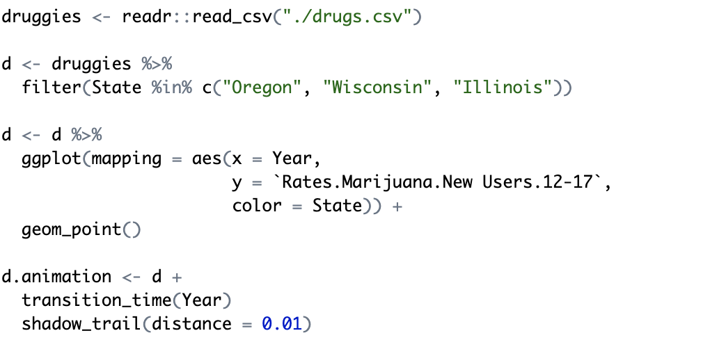
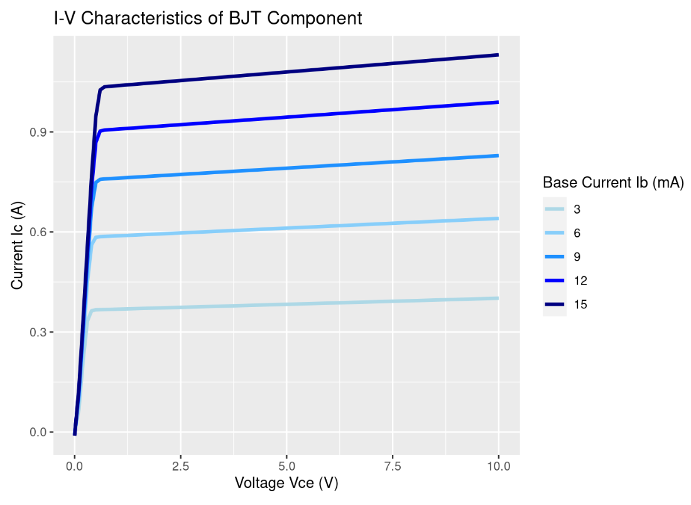

```{r setup, include=FALSE}
knitr::opts_chunk$set(echo = FALSE)
```

## What is `gganimate`? x
- Extension package used with `ggplot2` 
  
- Used to make animations using `ggplots`  
  - Can also save rendered plots as gifs  

```{r out.width = "30%",out.height = "30%",echo = FALSE, fig.align='center'}
#Image of slide 1
knitr::include_graphics("./images/gganimate_logo_small.png")
```

## Why use `gganimate`? {.build}
- Offers simple and easy to implement functions for adding animations
- Can improve visualization of change in data
- Adds to presentation of data
```{r out.width = "100%",out.height = "100%",echo = FALSE, fig.align='center'}
#Image of slide 1

```


## `gganimate` Basics & Examples {.build}
- `gganimate` is primarily applied to ggplot objects by specifying transitions to use  
- There are 4 primary transition functions that will be covered:  
  - `transition_time()` 
  - `transition_reveal()` 
  - `transition_filter()`  
  - `transition_states()`  
  
## Getting Started {.build}
Getting started with `gganimate` could not be easier!

To start, create a regular `ggplot`.
Then, add a transition layer based on what you want to change

```{r eval=TRUE,echo=FALSE,out.width="80%",out.height="100%",fig.align='default',fig.show='hold'}

```


## `transition_time()` {.build}
- `transition_time()` is useful for showing differences in variables over time
- This is a very intuitive and interesting way to show time
- You can also make time a third variable in a two-dimensional graph
  
Let's look at the example from the last slide

## `transition_time()` Example {.build}
```{r out.width = "50%", out.height = "50%",echo = FALSE, fig.align='center'}

``` 

This is not very clear, since the trends are very hard to see

Let's fix that!

## `shadow_trail()`
- `shadow_trail` and will keep points behind the moving value, called a shadow
- This allows the trends to be easier to see

## `shadow_trail()` Example {.build}
```{r out.width = "47%", out.height = "50%",echo = FALSE, fig.align='center'}


```

  
## `transition_time()` vs `transition_reveal()`
- The plot on the left shows all the seasons in NBA history in which a player averaged at least 30 points per game
- On the right the plot is animated using `transition_time()`

```{r, eval = TRUE, echo=FALSE, fig.show='hold', out.height="50%", out.width="50%"}

knitr::include_graphics("scorers_time.gif")

```

- Once again, the animation does not communicate much since the points disappear very quickly

## `transition_time()` vs `transition_reveal()`
- Instead of using `shadow_trails`, we can see what the whole plot looks like using `transition_reveal()`
- The animation on the left uses `transition_time()` and the animation on the right uses `transition_reveal()`

```{r, eval=TRUE,echo=FALSE, fig.show='hold', out.height="50%", out.width="50%"}
knitr::include_graphics("scorers_time.gif")

```
- `transition_reveal()` does a much better job of communicating the data than `transition_time()` on its own

## `shadow_wake()` {.build}
- The animation can still be improved though. Any player that occurs on the list multiple times is only on the plot once
- Using the `shadow_wake()` function of `gganimate`, we can add a wake to these players to show their scoring over their career
- `shadow_wake()` is similar to `shadow_trail()`, but the points eventually fade
- The amount of time the points stay visible can be set with `wake_length`

```{r,eval=TRUE,echo=FALSE, fig.show='hold', out.height="50%", out.width="50%"}


```

## `shadow_wake()`
- Here are the animations side by side

```{r, eval=TRUE,echo=FALSE, fig.show='hold', out.height="50%", out.width="50%"}


```
- `Shadow_wake()` communicates who the most productive players were over the course of their career instead of just a single season

## `transition_filter()` {.build}
- The plot below shows all the cars in mtcars on a scatter plot with miles per gallon on the x-axis and horsepower on the y-axis
- This plot does not communicate much aside from the relationship between horsepower and miles per gallon
```{r, eval=TRUE,echo=FALSE, fig.show='hold', out.height="45%", out.width="45%"}


```
- Some simple animation could improve this plot

## `transition_filter()`
- `transition_filter()` creates an animation that cycles through different filters of the data
- We can use other variables from mtcars other than hp and mpg to set filters 
- This can be used as an alternative to faceting

```{r,eval=TRUE,echo=FALSE, fig.show='hold', out.height="50%", out.width="50%"}


```

## tranistion_filter()
- Once the transition_filter() function is applied our static plot is transformed into a more informative animation
```{r, eval=TRUE,echo=FALSE, fig.show='hold', out.height="50%", out.width="50%", fig.align='center'}

```
- The animation communicates trends within certain filters that would not be shown in a single, static plot

## `transition_states()` {.build}
- `transition_states()` is useful for non-time related transitions between data
- Also can make use of other fields or options to improve animation
  
So, let's look at an example

## `transition_states()` Example(1)
- Suppose we look at some simulated data of a BJT transistor circuit component:  
- The output behavior of the component generally looked at is voltage vs current  
- In this case, that would be Vce vs. Ic

```{r echo=FALSE,out.width="45%",out.height="45%",fig.align='center'}
knitr::include_graphics("./images/bjtdata_codechunk.PNG")
```

## `transition_states()` Example(2)
- The output function also depends on an input current Ib, however, and varies accordingly  
- As such, we get the following `ggplot`

```{r eval=TRUE,echo=FALSE,out.width="50%",out.height="100%",fig.align='default',fig.show='hold'}

knitr::include_graphics("./images/ggplot_codechunk.PNG")
```

## `transition_states()` Example(3)
- Showing the data in this format indicates the behavior, but we can improve it is communicated
- Applying state transitions to the Ib value, the behavior can then be made into the following animated plot
```{r eval=TRUE,echo=FALSE,out.width="50%",out.height="100%",fig.align='default',fig.show='hold'}
knitr::include_graphics("./images/anim_bjt1.gif")

```

## `transition_states()` Example(4)
- This better indicates how the function output behavior increases as Ib increases
- Furthermore, making use of `shadow_mark()`, we can then add onto the existing plot
  - `shadow_mark()` is similar to `shadow_trail()`, however it leaves a mark at the data state
```{r eval=TRUE,echo=FALSE,out.width="50%",out.height="100%",fig.align='default',fig.show='hold'}

knitr::include_graphics("./images/transitionstate_codechunk2.PNG")
```